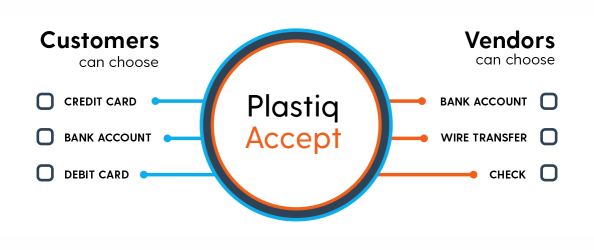

# You Can Pay Any Bill With a Credit Card Via Plastiq
> *Author's Note* - In December 2019, I was given the opportunity to invest in a venture capital fund through Alumni Ventures Group. One of the first companies the fund invested in was Plastiq, which I did not explore until now. -- _Ankur Goel_

## What is Plastiq[1](#f1)

Plastiq is a service that lets individuals and businesses use debit or credit cards to pay vendors that don't otherwise accept those payment methods.[4](#f4) For example, most mortgage lenders do not accept credit cards, so payments are made with check, ACH payments, or wire transfer. But Plastiq will act as a middle-man, taking a payment via credit card, and then paying a bill via check (which read as coming from the user, not Plastiq)

In exchange for this convenience, Plastiq charges a processing fee, which can be expensive — as of March 2021, it was 2.85% for credit cards and 1% for debit cards. Further, if the card-payer cannot pay off credit card bills each month, they will incur interest at whatever ongoing rate the card charges.

There are several reasons to use this service:

* It is cheaper than a high-interest option like a cash advance or a pay-day loan.
* It could allow breathing room for a paycheck to arrive
* If the card-user has a rewards credit card, it can help defray the processing fee. Common cards offer between 1.5% and 2% cash-back, or other rewards perks.
* It automatically adds a 45 day float to the cash cycle, allowing receivables and payables to better match.
* Many rewards card offer large bonuses for signing up if you spend a large amount during an intial period. Using Plastiq for that initial monthly spend can pay back several times over.
* Many card-users prefer the convenience of paying a single credit card bill, instead of having to pay several different bills. Bill-pay services from banks offer similar conveniences.

Common consumer uses for Plastiq include paying:

* rent
* mortgage
* utilties
* day care
* tuition 
* insurance
* taxes and government fees
* homeowners association fees

> *Note* - Different credit cards have different exclusions for what they will allow their cards to be charged. For example, Visa and American Express will not allow their cards to be used on mortgage payments.[5](#f5) 

### Focus on SMBs
As Plastiq has evolved over the last 9 years, Small and Medium Business's (SMBs) have become the larger user of the Plastiq services.[6](#f6)  Plastiq provides them with cash flow, especially for seasonal businesses such a restaurants and tourist companies. Although many companies are in the business of providing cash-flow for small businesses by offering loans, Plastiq simply unlocks a payment opportunity using already existing credit facilities of credit cards. Plastiq is enable $2 billion in transactions, allowing a nearly $100 million revenue run rate.

During the beginning stages of the COVID-19 pandemic, Plastiq was able to help SMBs obtain financing when traditional loan facilities were drying up and not as easy to access.

## Background on Plastiq

When CEO Eliot Buchanan was at Harvard in 2012, he faced a tricky problem when it came for paying his tuition. As a Canadian without a credit score, the only type of credit card he could get was a cash secured card from a local bank. After scrambling to find one, he was faced with another problem: his college didn’t accept credit cards.

> “It just felt so disempowering,” he said. “I began questioning why you couldn’t pay for big ticket items like tuition with a credit card.”

That was the genesis for Plastiq, the company he founded as an undergrad. It turns out that there are a lot of industries that are still cash-based and don’t accept credit cards, preferring instead to use wires, ACH and checks.[11](#f11) 

Initially, the first cohort of customers only used Plastiq to pay off tuition fees for Buchanan and his friends. They liked the credit card rewards so much, they asked him to expand the services to taxes and rent.

The next push was to create a mobile app.[12](#f12) The use case was for a consumer to take a picture of their bill in the phone, and the app would intelligently figure out who the vendor was, what payment was due, and when it was due. The app would then charge the user's credit card and send the payment to the vendor prior to the due date.

While the app still can work that way, it turns out that businesses like the service even more than consumers, such that 90% of Plastiq's customer base is now SMBs. 

## Funding Rounds
Plastiq has seen steady consumer and SMB growth since inception, leading to several funding rounds:[3](#f3)

| Date | Transaction Name | Money Raised | Lead Investor |
| ---- | ---------------- | ------------ | ------------- |
| Mar 25, 2020 | Series D | $75M | B Capital Broup |
| Oct 29, 2019 | Venture Round | $4M | Alumni Venture Group |
| Nov 19, 2019 | Series C | $27M  | Kleiner Perkins |
| May 16, 2018 | Series B | $16M  | Atlas Ventures |
| Jul 15, 2014 | Series B | $10M | Khosla Ventures |
| Feb 28, 2013 | Series A | $6M | Atlast Ventures |
| May 11, 2012 | Venture Round | $2.3M | NextView Ventures |

> *NOTE* - The Oct 29, 2019 round from Alumni Ventures Group includes a $2,000 stake from the author of this report.

The total capital raise for Plastiq now exceeds $140 milliion. With the latest Series D, Plastiq is focusing on SMB for revenue growth by building out features to give them faster services around payments and processing.

## Business Activities
In a podcast with entrepreneur.com[7](#f7), CEO Eliot Buchanan lays out the 3 primary business products:

1. Enabling SMBs to pay bills via credit card
2. Enabling merchants paid by Plastiq to get paid sooner and manage their cash flows from Plastic
3. Data mining both payment inflow and outflow from Plastiq like Shopify and Paypal.  

### Pay Bills with Credit Cards

This core business for Plastiq is mature and growing. Each Plastiq accoiunt comes with a personalized dashboard that gives insights into payment with Plastiq, including email notifications when the recipient receives the payment. [9](#f9)

For businesses, this impact on cash flow is extremely powerful[10](#f10):

1. Small businesses with limited financing via banks can rely on credit cards for purchases
2. A credit line can all businesses to make bigger purchases from vendors that offer volume discounts.
3. It is easier to purchase from international vendors because currency conversions are automatic and nearly cost-free.
4. Many vendors offer early payment discounts, usually around 3%. This would completely offset the 2.85% fee charged by Plastiq.
5. The Plastiq fee can be written off as a tax expense.

Plastiq works with credit card companies instead of competing with them. Because Plastiq is able to bring in merchants who otherwise wouldn't offer credit card processing, Plastiq is able to negotiate low credit card fees with Visa, Mastercard, and Amex along with their issuing banks. They can even partner with banks to help issue credit cards to small businesses, to further increase the amount of credit card transactions.

### Merchant Cashflow Services

With the initial product, merchants did not know they were being paid by Plastiq. But Plastiq has added a new business line where merchants can sign up with Plastiq and get paid by any method. This product is known as Plastiq Accept.

With Plastiq Accept, merchants can paid via any method they prefer, at no cost to them. They can choose to be paid via ACH, check, or wire transfer. This allows even the smallest eBay or Amazon seller to accept any method they want without the fees associated with Paypal.

To better manage their cash flow, Plastiq can offer them a dashboard when payments are due and can offer pre-payments for a small fee to better manage cash flow. They can also send out invoices, a service that competes directly with Square. Now that Plastiq has millions of customers paying into 100s of thousands of merchants, merchant services should be the next growth area for Plastiq.

### Data Mining

Finally, the future frontier for Plastiq is to take thee data on billions of dollars in transactions, and try to mine it for trends. By exposing the core technology to the rest of the FinTech ecosystem, Plastiq can enable new payment technologies and markets. If a company can use Plastiq on both revenues and spending, Plastiq would be able to mine the data and track a business's financial health.

## Landscape

With the focus on SMBs, there is no shortage of competition from other companies also trying to solve pain points in small-business cash flow. According to CEO Eliot Buchanan, Plastiq’s biggest competitors are traditional lenders, as well as companies like Kabbage and Fundbox. Similar claims could be made about Brex, which offers a credit card for startups to access capital faster. [6](#f6)

Kabbage provides funding to SMBs through automated business loans. The SoftBank-backed company landed $200 million in a revolving credit line back in July, fresh off of landing strong partnerships with banks and giants like Alibaba to access more customers. Kabbage loans out roughly $2-3 billion to SMBs every year. 

Other Fintech companies that compete in the SMB lending space include:[7](#f7)

 * Lendio - The company connects SMBs with over 300 SBA-approved financial institutions get loan approval instantly, becoming a large facilitator of PPP loans
 * BlueVine - The company offers a full suite of banking services to SMBs including business checking, lines of credit, and invoice factoring
 * Fundbox - a platform to get securely analyze businesses for credit approval
 * CircleUp - provides an investment platform for innovate, early-stage consumer brands
 * Pay1040 / Link2Gov - an authorized IRS service provider that charges 1.99% for credit card payments on taxes

## Results

Plastiq also revealed significant growth in the second half of 2020.[13](#f13), particularly from businesses in eCommerce and healthcare (specifically Amazon and Etsy sellers). 

Their latest Series D funding round puts their valuation around $800 million. They boast over 50,000 small business customers and process nearly $4 billion in transactions a year.

Plastiq was name to the 2020 Forbes FinTech 50 list[14](#f14), and is #366 on Forbes Best Startup Employers of 2021.

## Recommendations
### Focus on the ESG
In August 2010, the Federal Reserve Bank of Boston issued a report on the consumer ramification of the entire credit card payment system.[2](#f2) The report highlights the regressive nature of credit card payments as follows:

1. Consumers look at credit card as a system with perks - points, cash back, delayed payments, etc.
2. But merchants are acutely aware of fees that are proportional to sale, who want to pass on those costs to the consumer. However, credit card companies discourage charging surcharges based on credit card use.
3. Therefore, the merchant increases the costs of goods for all credit **and** cash users.
4. This blanket price increase results in cash-paying households paying $149 to card-using households, and each card-using household receiving $1,133 from cash users every year.
5. Because credit card spending and rewards are positively correlated with high-income households, the entire credit card payment system becomes a regressive transfer of wealth.
6. The paper recommends reducing merchange fees and card rewards to reverse this regressive transfer.

Plastiq represents an alternate method, because they specifically charge the credit card surcharge to the consumer, and the merchant has no fees. Therefore, cash-using households do not incur a blanket price increase due to card-users, and the card-users pay specfically for the perks they like.

Because merchants do not bear any fees, they leave prices low for cash-using households and do not incur this societal transfer from poorer households to richer households. 

Plastiq can capitalize on the trend for investor to focus on ESG funds, and sell their Societal benefits.

### Bring other payment methods
With the current boom in cryptocurrencies, Plastiq should offer payments denominated in bitcoin or ethereum. Increasing the overall use case of cryptocurrencies, Plastiq would be able to gather more market data on the use of alternate currencies, and together with programs such as the Blockfi credit card, be able to gain significant interest on their payment float between paying and receiving. 

## Links
<b id="f1">1</b> http://www.plastiq.com [↩](#a1)  
<b id="f2">2</b>https://www.bostonfed.org/publications/public-policy-discussion-paper/2010/who-gains-and-who-loses-from-credit-card-payments-theory-and-calibrations.aspx[↩](#a2)  
<b id="f3">3</b> https://www.crunchbase.com/organization/plastiq/company_financials [↩](#a3)  
<b id="f4">4</b>https://www.nerdwallet.com/article/credit-cards/what-is-plastiq [↩](#a4)  
<b id="f5">5</b>https://help.plastiq.com/hc/en-us/articles/360005215254-Personal-Visa-Card-Restrictions [↩](#a5)  
<b id="f6">6</b>https://techcrunch.com/2020/03/25/plastiq-raises-75m-to-help-small-businesses-use-credit-cards-more/[↩](#a6)  
<b id="f7">7</b>https://ibsintelligence.com/ibsi-news/4-u-s-based-fintech-companies-transforming-small-business-lending/[↩](#a7)  
<b id="f8">8</b>https://www.entrepreneur.com/listen/action-and-ambition/359114  [↩](#a8)  
<b id="f9">9</b>https://www.plastiq.com/blog/2019/08/a-money-transfer-service-for-you/  [↩](#a9)  
<b id="f10">10</b>https://www.plastiq.com/blog/2020/11/plastiq-is-a-critical-cash-flow-tool/  [↩](#a10)  
<b id="f11">11</b>https://tearsheet.co/payments/the-nice-thing-about-our-model-is-everyone-wins-plastiq-allows-consumers-to-use-credit-cards-at-businesses-that-dont-accept-them/[↩](#a11)  
<b id="f12">12</b>https://techcrunch.com/2016/04/21/plastiq-lets-you-pay-any-bill-with-your-credit-or-debit-card-just-by-snapping-a-photo/[↩](#a12)   
<b id="f13">13</b>https://www.crowdfundinsider.com/2020/12/170551-plastiq-expands-scope-of-payments-platform-to-u-s-cash-payments-in-additional-to-credit-card-payments/ [↩](#a13)  
<b id="f14">14</b>https://www.forbes.com/fintech/2020/#e3104d24acd7[↩](#a14)  